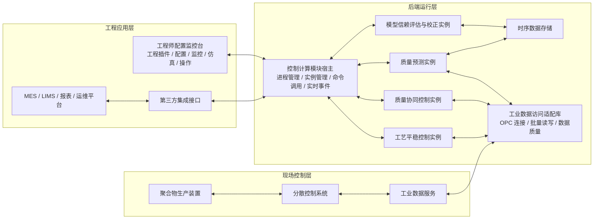
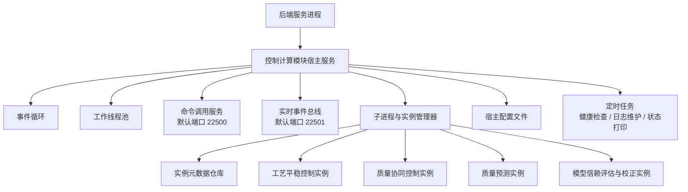
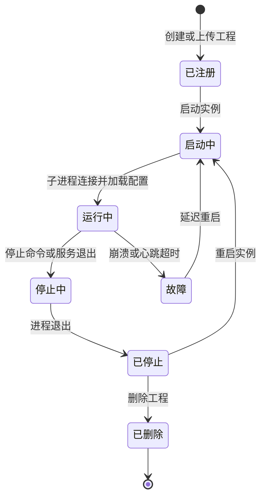
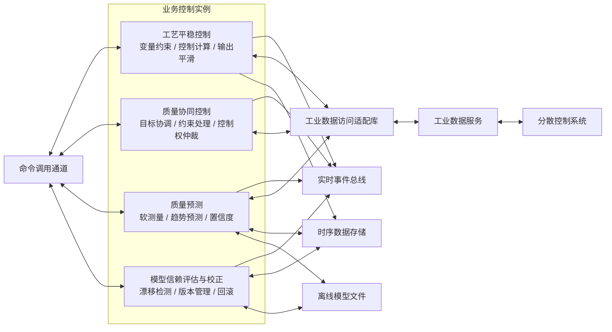
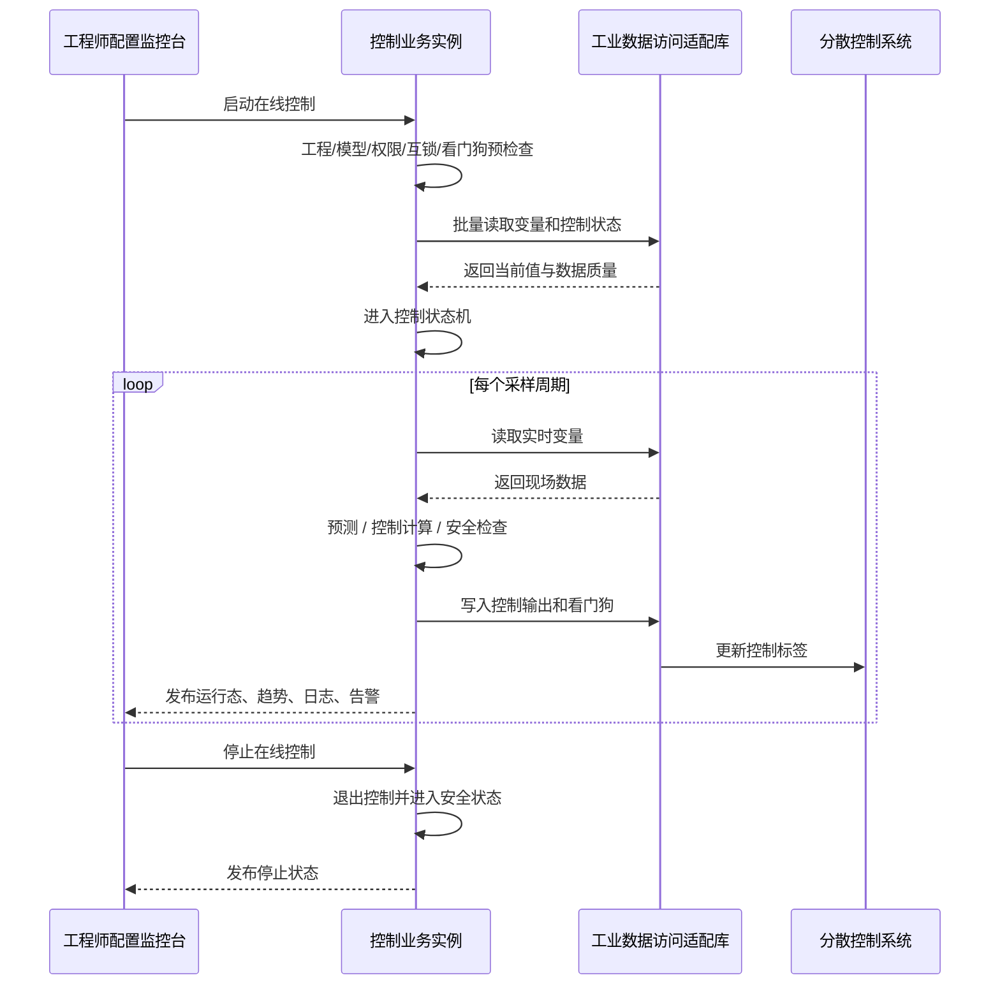
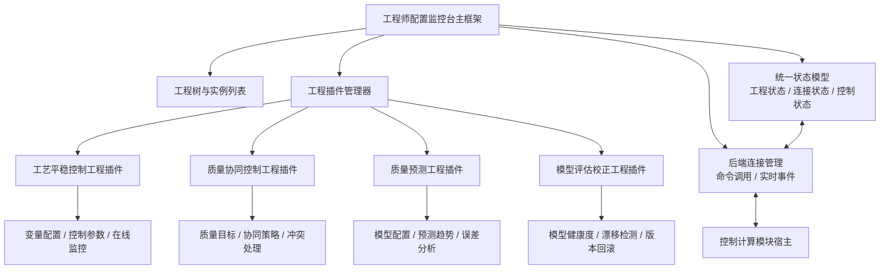
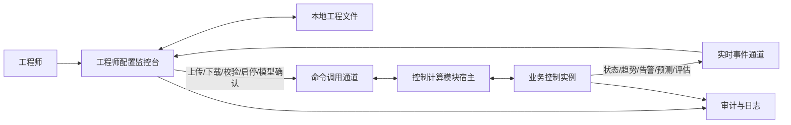
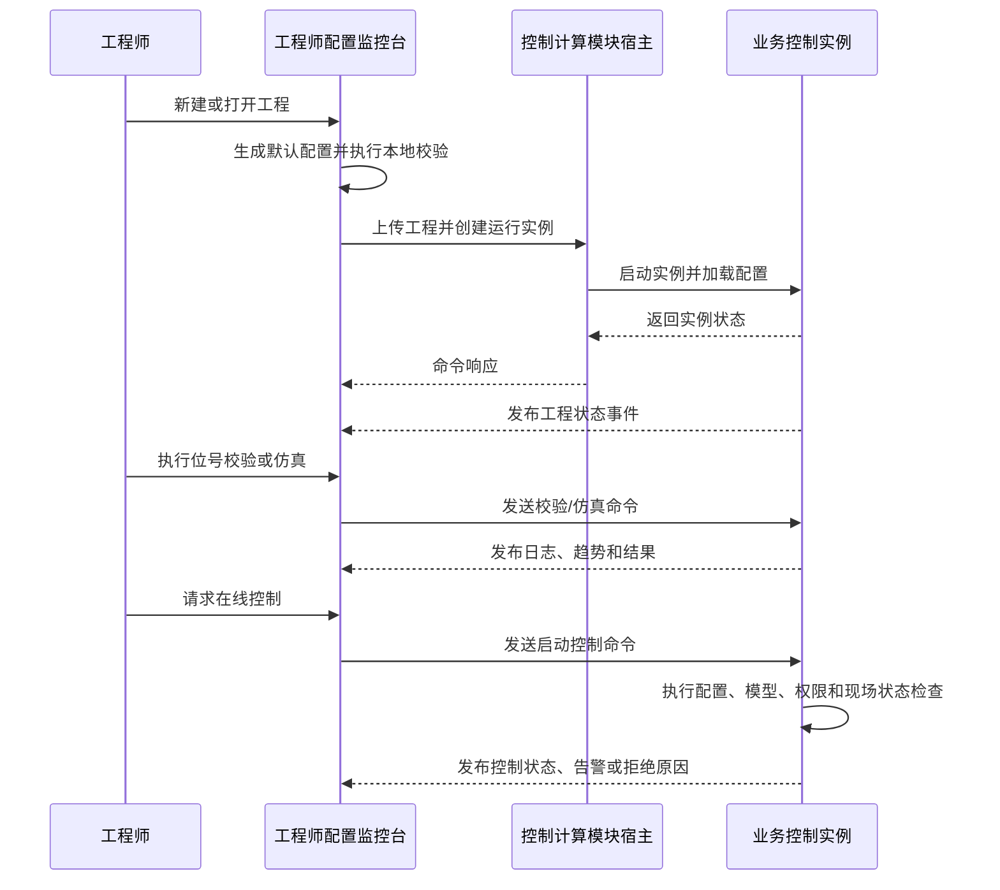
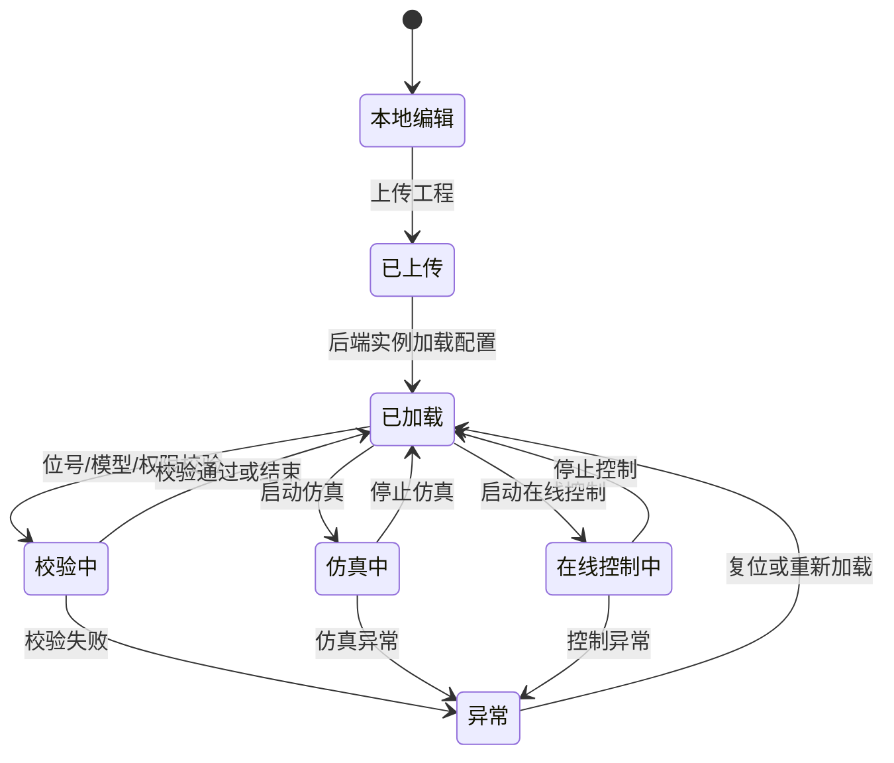

# 聚合物产品质量实时控制系统架构摘要

## 第 1 页：总体架构

### 架构原则

聚合物产品质量实时控制系统面向连续化工生产场景，架构上采用“现场控制、后端运行、工程应用”三层分离模式。现场控制层保留既有分散控制系统和工业数据服务的基础控制职责；后端运行层负责实时计算、预测、协调、模型治理和安全写入；工程应用层负责配置、监控、仿真、测试和人工确认。系统内部将命令请求、实时事件、工业数据访问和第三方集成明确分流：配置和启停类操作走命令调用通道，运行态和趋势类数据走实时事件总线，工业控制读写集中在后端模块内完成，第三方系统只通过受控集成接口访问非实时能力。

### 架构框架图

### 组件功能与设计说明

| 组件 | 功能定位 | 设计要点 |
| --- | --- | --- |
| 聚合物生产装置 | 被控对象，产生工艺变量和质量结果。 | 不改变既有现场控制边界，先进控制只作为上层优化和建议来源。 |
| 分散控制系统 | 执行基础控制、联锁保护、手自动切换和控制输出落地。 | 所有写入必须受手自动状态、控制权、上下限和联锁状态约束。 |
| 工业数据服务 | 向后端提供现场实时数据读写入口。 | 前端不直接连接工业数据服务，避免绕过控制安全边界。 |
| 控制计算模块宿主 | 后端统一运行容器和管理入口。 | 只负责进程、实例、通信、日志、配置和外部适配，不承载具体控制算法。 |
| 业务控制实例 | 承载工艺平稳、质量协同、质量预测、模型治理等业务能力。 | 按能力拆分，独立部署、独立测试、独立升级，实例之间通过命令和事件交互。 |
| 工业数据访问适配库 | 封装工业数据连接、批量读写、重连和数据质量判断。 | 作为所有业务实例访问现场数据的唯一后端通道。 |
| 工程师配置监控台 | 工程师进行配置、监控、仿真、启停和模型确认的主入口。 | 以工程插件方式扩展，不执行实时闭环计算，不直接写现场控制标签。 |
| 第三方集成接口 | 向企业系统提供查询、报表、审计和非实时操作能力。 | 内部转换为后端命令调用，不替代实时控制主链路。 |

<!-- pagebreak -->

---

## 第 2 页：后端架构（一）控制计算模块宿主

### 架构原则

后端架构以“宿主轻量、业务下沉、通信标准、安全集中”为原则。控制计算模块宿主只提供可复用基础设施，包括服务化运行、子进程管理、业务实例生命周期、命令调用入口、实时事件发布、配置加载、元数据持久化和第三方接口适配。具体的聚合物控制策略、预测模型、模型评估逻辑、工业位号语义和控制输出计算均放在业务控制实例中，避免宿主膨胀，也便于新增控制能力时按实例类型扩展。

### 架构框架图

### 组件功能与设计说明

| 组件 | 功能定位 | 设计说明 |
| --- | --- | --- |
| 后端服务进程 | 现场长期运行的后台服务或开发调试进程。 | 支持后台服务、前台控制台、子进程工作等运行模式；生产环境建议以系统服务方式托管。 |
| 控制计算模块宿主服务 | 后端主控对象。 | 统一初始化事件循环、线程池、命令服务、事件总线、子进程管理器和定时任务。 |
| 事件循环 | 处理网络连接、定时器、事件分发等异步任务。 | 保证通信、状态发布和基础设施任务在统一事件模型下运行。 |
| 工作线程池 | 承载可并行的计算、请求处理和辅助任务。 | 线程数由配置控制，可按 CPU 核数自动设置。 |
| 命令调用服务 | 提供请求-响应式管理和业务命令入口。 | 适用于工程上传、实例创建、启动控制、停止控制、配置下载、模型切换等有明确响应的操作。 |
| 实时事件总线 | 提供发布-订阅式运行态传递。 | 适用于日志、告警、趋势、控制周期、预测结果、模型健康度和工程实例状态变化。 |
| 子进程与实例管理器 | 创建、启动、停止、重启和删除业务控制实例。 | 通过实例类型匹配对应业务模块；实例崩溃后可按策略重启并上报状态。 |
| 实例元数据仓库 | 持久化实例名称、类型、工程路径、状态和启动参数。 | 支持服务重启后的实例恢复、工程列表查询和审计追踪。 |
| 宿主配置文件 | 描述线程、日志、端口、工程目录和预置实例。 | 作为部署级配置，不保存具体业务算法参数。 |
| 定时任务 | 执行健康检查、日志保留、配置扫描和状态输出。 | 使现场运维可以持续观察宿主自身健康状态。 |

### 生命周期设计

生命周期设计强调可观测和可恢复：每个实例都有明确的注册、启动、运行、停止、故障、删除状态；状态变化通过实时事件总线发布给工程师配置监控台；关键元数据写入仓库，以支持异常重启后的恢复和审计。

<!-- pagebreak -->

---

## 第 3 页：后端架构（二）业务控制模块与数据链路

### 架构原则

业务后端遵循“能力模块化、数据源统一、安全状态机先行”的原则。工艺平稳控制、质量协同控制、质量预测、模型信赖评估与校正分别作为独立业务控制实例运行；实例之间不共享可变内存，而是通过命令调用和实时事件完成协同；所有现场读写统一经过工业数据访问适配库；在线控制启动前必须完成工程配置、模型状态、工业数据连接、控制权限、手自动状态、看门狗和互锁校验。

### 架构框架图

### 组件功能与设计说明

| 组件 | 功能定位 | 设计说明 |
| --- | --- | --- |
| 工艺平稳控制实例 | 对关键工艺变量执行实时平稳控制。 | 管理被控变量、操作变量、干扰变量、上下限、变化率、手自动状态和控制输出；每个采样周期完成读数、计算、安全检查和写入。 |
| 质量协同控制实例 | 协调多个质量目标、多个控制器和多个装置层级。 | 处理质量目标优先级、约束冲突、控制权租约和降级策略；默认不直接写现场，除非被配置为最终输出实例。 |
| 质量预测实例 | 根据工艺变量、历史数据、实验室数据和牌号信息预测质量指标。 | 输出当前预测值、未来趋势、置信度、残差和可用性标志，为协同控制和模型治理提供依据。 |
| 模型信赖评估与校正实例 | 判断模型是否可靠，并管理离线模型生效过程。 | 检测模型漂移、残差异常、数据分布变化和工况切换；模型切换默认需要工程师确认，并保留回滚路径。 |
| 工业数据访问适配库 | 后端访问现场数据的统一适配层。 | 提供连接管理、批量读写、断线重连、数据质量标记、读写权限校验和异常报告。 |
| 时序数据存储 | 保存趋势、历史片段、预测结果和模型评估数据。 | 高频历史不通过一次命令调用全量传输，避免阻塞工程界面和实时链路。 |
| 离线模型文件 | 保存离线辨识或训练后的模型及版本元数据。 | 新模型先进入评估和确认流程，满足条件后受控生效。 |

### 在线控制数据流

### 安全与降级策略

在线控制必须坚持“先验证、后运行、异常即降级”。工业数据服务连接失败、关键位号不可读写、分散控制系统拒写、手自动状态不允许、看门狗失败、同一输出标签存在其他活动控制器等情况，都应阻止启动或触发停止/冻结/保持策略。模型预测置信度不足时，质量协同控制应降低自动调整权重，必要时转为建议模式。所有启动、停止、参数修改、模型切换和异常处理都需要进入审计日志。

<!-- pagebreak -->

---

## 第 4 页：前端架构（一）工程插件与界面组织

### 架构原则

前端架构以“工程化操作、插件化扩展、前端不闭环、界面即状态”为原则。工程师配置监控台作为统一入口，按业务能力注册不同工程插件，每类插件对应一种后端业务控制实例。前端负责工程文件、配置校验、连接管理、运行监控、趋势展示、仿真测试、模型确认和操作审计；不执行实时控制闭环，不直接访问工业数据服务，不绕过后端安全状态机写入现场标签。

### 架构框架图

### 组件功能与设计说明

| 组件 | 功能定位 | 设计说明 |
| --- | --- | --- |
| 工程师配置监控台主框架 | 提供统一工作区、菜单、工程树、连接状态和消息中心。 | 面向工程师的长期操作场景，界面应强调信息密度、状态清晰和低误操作。 |
| 工程树与实例列表 | 展示本地工程、远程实例、运行状态和连接关系。 | 支持创建、打开、上传、下载、启动、停止、删除和重启工程实例。 |
| 工程插件管理器 | 根据工程类型加载对应插件。 | 新增控制能力时，只需新增后端实例类型和前端工程插件，不影响其他插件。 |
| 后端连接管理 | 封装命令调用和实时事件订阅。 | 命令调用用于配置同步和操作确认；实时事件用于状态、趋势、日志、告警推送。 |
| 统一状态模型 | 将连接状态、工程状态、控制状态和告警状态统一呈现。 | 避免界面不同区域显示不一致，支持断线重连后的状态恢复。 |
| 工艺平稳控制工程插件 | 面向工艺变量和控制参数。 | 提供位号配置、上下限、变化率、手自动状态、控制输出、趋势和启停操作。 |
| 质量协同控制工程插件 | 面向质量目标和控制策略协调。 | 提供质量指标、目标优先级、约束、控制权、冲突处理和降级策略配置。 |
| 质量预测工程插件 | 面向软测量和质量趋势预测。 | 提供模型选择、输入变量、预测结果、置信度、残差和预测有效性展示。 |
| 模型评估校正工程插件 | 面向模型健康度和版本治理。 | 提供漂移检测、离线模型导入、评估结果、人工确认、生效记录和回滚操作。 |

### 页面组织建议

| 页面 | 主要内容 | 设计要点 |
| --- | --- | --- |
| 工程总览 | 工程状态、后端连接、当前模式、主要告警、版本信息。 | 作为默认页面，快速回答“当前是否安全、是否在线、是否可操作”。 |
| 变量配置 | 位号、变量类型、单位、上下限、读写属性、有效性。 | 提供批量校验结果，不允许未通过校验的关键位号进入在线控制。 |
| 算法配置 | 控制参数、预测模型参数、权重、约束、评估策略。 | 参数修改应区分本地未保存、已上传、运行中已生效等状态。 |
| 在线监控 | 实时趋势、当前值、目标值、控制输出、质量预测值。 | 高频数据来自实时事件，界面侧只保留显示窗口和轻量缓存。 |
| 测试仿真 | 数据回放、阶跃测试、模型测试、离线仿真。 | 支持不连接现场控制系统的离线验证流程。 |
| 模型管理 | 模型版本、校正记录、评估结果、生效和回滚。 | 生产环境中新模型默认只生成建议，生效需明确确认。 |
| 日志告警 | 后端日志、操作记录、告警列表和确认记录。 | 告警应按严重程度、实例、变量和时间范围过滤。 |

<!-- pagebreak -->

---

## 第 5 页：前端架构（二）交互流程与运行视图

### 架构原则

前端交互设计强调“操作闭环可确认、运行状态可追踪、异常恢复可解释”。工程师的每次关键操作都应有清晰的前置校验、命令响应、状态变化和事件反馈；界面展示不只显示按钮是否可点，更要显示为什么可操作或不可操作。对于在线控制、模型切换、第三方写操作等高风险动作，前端必须提供确认、权限校验、审计记录和回滚入口。

### 架构框架图

### 核心交互流程

### 组件功能与设计说明

| 组件 | 功能定位 | 设计说明 |
| --- | --- | --- |
| 本地工程文件 | 保存工程配置、界面配置、模型引用和离线测试数据引用。 | 本地文件用于编辑和版本管理，运行生效以已上传到后端的配置为准。 |
| 上传与下载流程 | 在本地工程和后端实例之间同步配置。 | 上传前做本地格式校验，后端再做业务校验和工业数据校验；下载用于恢复现场真实运行配置。 |
| 位号校验流程 | 验证工业数据服务连接、读写权限、数据类型和关键标签可用性。 | 校验结果应绑定到变量表，支持按变量、错误类型、严重程度筛选。 |
| 仿真与测试流程 | 使用仿真源或历史文件验证工程配置和模型行为。 | 与在线控制隔离，便于算法调试和操作培训。 |
| 在线控制流程 | 发起启动、停止、参数调整和安全退出。 | 前端只发命令和显示状态，控制周期计算与现场写入全部在后端实例中完成。 |
| 模型确认流程 | 展示离线模型评估结果，并由工程师确认是否生效。 | 生效前显示版本差异、验证指标、风险提示和回滚路径。 |
| 审计与日志视图 | 汇总工程操作、后端日志、告警确认和模型变更记录。 | 支持按时间、工程、实例、用户、变量和严重程度检索。 |

### 运行状态视图

运行状态视图应直接驱动界面可用性：未上传的工程不能启动后端实例，未通过关键校验的工程不能进入在线控制，仿真中和在线控制中不能随意修改关键位号，异常状态必须显示原因、影响范围、建议操作和恢复入口。通过这种方式，前端不仅是配置编辑器，也是现场运行状态的解释层和操作保护层。
