# 聚合物产品质量实时控制系统架构设计说明书

## 1. 文档说明

本文档描述“聚合物产品质量实时控制系统”的软件架构设计。文档自包含说明系统目标、总体架构、后端宿主、控制业务模块、前端工程插件、OPC/DCS 通讯、第三方接口、数据流、部署、安全、测试和演进路线。

本系统采用 `HostVM + 业务 modules + xOptCon application plugin` 的总体架构：

- `HostVM` 作为后端宿主，负责服务进程、子进程/子 VM 管理、RPC 通讯、Storm 事件广播、工程实例管理和第三方 HTTP API 适配。
- 各控制系统能力以独立 `modules` 实现，每类业务模块对应一种后端 VM 类型，负责具体控制、预测、模型评估、OPC/DCS 通讯和运行闭环。
- `xOptCon` 作为前端工程框架，每类控制系统模块对应一种 application plugin 工程类型，负责配置、监控、操作、仿真和测试界面。
- `libidh` 作为 OPC 通讯基础库，由后端业务模块统一访问 DCS/OPC Server，前端不直接访问 DCS。

## 2. 系统建设目标

聚合物产品质量实时控制系统面向连续化工生产场景，目标是在已有 DCS 控制基础上增加先进控制、质量预测、模型治理和工程化操作界面，提高产品质量稳定性、控制闭环可靠性和工程维护效率。

系统主要建设内容包括：

| 建设内容 | 说明 |
| --- | --- |
| 工艺平稳控制模块 | 对关键工艺变量进行实时平稳控制，抑制扰动，保障装置运行稳定。 |
| 质量协同控制模块 | 面向多个质量指标、多个控制器、多个装置层级进行目标协调和约束处理。 |
| 质量预测模块 | 基于软测量或预测模型，实时估计聚合物质量指标和未来趋势。 |
| 模型信赖评估与校正模块 | 评估模型可信度，检测模型漂移，导入离线辨识/校正后的模型并进行受控生效。 |
| UI 界面设计 | 在 xOptCon 中为每类控制能力提供独立工程类型和专业操作界面。 |
| 信息流设计 | 明确 DCS、OPC、HostVM、业务 VM、xOptCon 和第三方应用之间的信息流。 |
| 通讯接口开发 | 支持原生 RPC/Storm、OPC/DCS 通讯和可选 HTTP API。 |
| 功能与性能测试 | 支持仿真、联调、长周期运行、异常恢复、实时性和安全性测试。 |

## 3. 架构设计原则

1. 宿主与业务分离  
   `HostVM` 只承担进程管理、VM 宿主、通信、配置、日志、服务化和外部 API 适配，不包含聚合物控制业务算法。

2. 模块按业务能力拆分  
   工艺平稳控制、质量协同控制、质量预测、模型评估校正等能力分别实现为独立 module，降低耦合，便于单独测试、部署和升级。

3. 前后端按工程类型对应  
   xOptCon 中每种 application plugin 对应一种后端 VM 类型。前端工程类型负责配置和操作，后端 VM 类型负责执行和状态发布。

4. 实时链路使用原生 RPC/Storm  
   xOptCon 与 HostVM/module 的内部交互使用 ZVM RPC 处理命令，使用 Storm 发布状态和实时数据。HTTP API 只作为第三方集成接口，不替代实时主链路。

5. OPC/DCS 访问后端化  
   所有 OPC 读写、位号校验、DCS 手自动状态、看门狗和控制输出写入均由后端业务模块通过 `libidh` 完成，避免前端绕过控制安全边界。

6. 配置、运行态、历史数据分层  
   工程配置持久化到工程目录；运行态由 VM 内存维护并通过 Storm 发布；历史数据进入时序存储或归档服务，避免大体量历史数据阻塞 RPC。

7. 默认安全、可降级、可回滚  
   控制启动前必须进行配置、模型、DCS 和 OPC 校验；运行异常时进入安全状态；离线模型更新和模型生效应保留版本和回滚路径。

## 4. 总体架构

### 4.1 架构总览

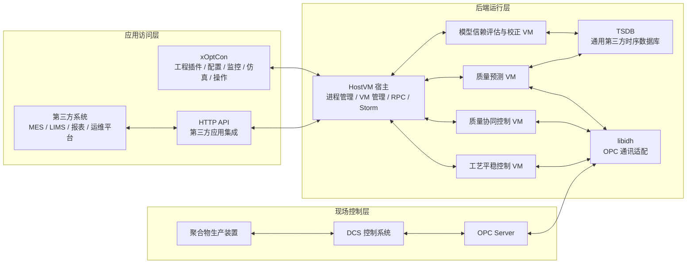

### 4.2 分层说明

| 层级 | 组件 | 主要职责 |
| --- | --- | --- |
| 现场控制层 | DCS、OPC Server、生产装置 | 采集现场数据，执行基础控制，提供 OPC 数据访问接口。 |
| 后端运行层 | HostVM、业务 modules、libidh、TSDB | 运行控制业务模块，访问 OPC，执行预测/控制/评估，发布状态并归档历史数据。 |
| 应用访问层 | xOptCon、HTTP API、第三方系统 | 提供工程配置、运行监控、控制操作、系统集成和数据访问。 |

### 4.3 三层两通道模型

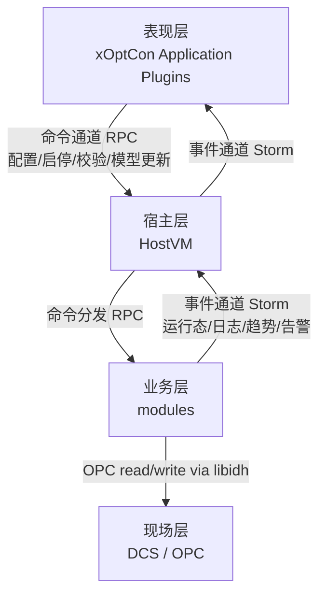

系统内部采用两类核心通道：

- 命令通道：使用 RPC，适合请求/响应类操作，例如工程上传、启动控制、停止控制、下载配置、验证 OPC 位号、更新模型。
- 事件通道：使用 Storm，适合发布/订阅类数据，例如日志、运行态、实时数据、趋势数据、历史数据片段、告警、工程实例变更。

## 5. HostVM 后端宿主设计

### 5.1 HostVM 定位

`HostVM` 是系统后端宿主进程，是所有业务 VM 的统一运行容器和管理入口。它本身不实现聚合物产品质量控制算法，而是提供业务 VM 的生命周期管理、进程隔离、远程调用、事件广播和外部集成能力。

### 5.2 HostVM 运行模式

| 模式 | 说明 |
| --- | --- |
| `daemon` | 后台守护进程模式，管理所有子 VM，适合生产部署。 |
| `console` | 前台运行模式，便于开发调试，逻辑等同 daemon。 |
| `work` | 子进程工作模式，由 daemon 自动拉起，用于加载具体 VM 类型。 |
| `service` | Windows 系统服务模式，用于现场长期运行。 |

### 5.3 HostVM 进程结构

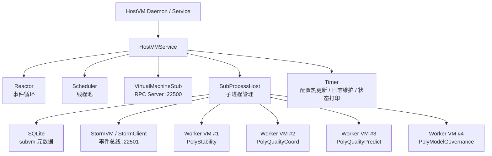

### 5.4 HostVM 核心职责

| 职责 | 说明 |
| --- | --- |
| 配置加载 | 读取 `hostvm.xml`，确定线程数、工程目录、RPC 端口、Storm 端口和预置子 VM。 |
| 子进程管理 | 根据 `vmtype/vmname/vmpath` 创建、启动、停止、重启和删除 VM 实例。 |
| 元数据持久化 | 将 VM 实例信息写入 SQLite，重启后恢复已注册工程。 |
| RPC 服务 | 在默认 `22500` 端口提供 VM 管理和业务转发入口。 |
| Storm 广播 | 在默认 `22501` 端口发布宿主日志、工程实例变化和运行事件。 |
| 运行监控 | 定时检查配置、日志保留、对象统计、内存池统计和版本信息。 |
| 第三方适配 | 可扩展 HTTP API，将第三方请求转换为内部 RPC 调用。 |

### 5.5 HostVM 不承担的职责

为保持架构清晰，以下职责不应放入 HostVM：

- 控制算法、预测算法、模型评估算法。
- 聚合物业务对象和工艺规则。
- OPC 位号业务语义和控制输出计算。
- 模型训练、离线辨识、漂移检测。
- 前端工程文件的业务解释和界面状态。

这些职责应由对应业务 module 和 xOptCon 工程插件实现。

### 5.6 VM 生命周期

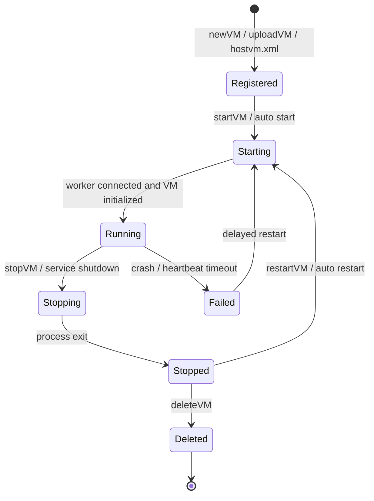

### 5.7 HostVM 配置模型

系统主配置文件为 `hostvm.xml`，包含宿主配置和预置子 VM 列表。

```xml
<hostvm_server>
  <hostvm_info threadnum="4"
               loglevel="0"
               keepdays="3"
               metadb_path="../MyProjects/subvm.db"
               projects_dir="../MyProjects"
               vmname="zmis"
               vmaddr=""
               vmtopic="vmhost.topic"
               vmport="22500"
               stormport="22501" />

  <subvm_info vmtype="PolyStability"
              vmname="stability_01"
              vmpath="_config.pstb"
              vmaddr="" />
  <subvm_info vmtype="PolyQualityCoord"
              vmname="quality_coord_01"
              vmpath="_config.pqcc"
              vmaddr="" />
  <subvm_info vmtype="PolyQualityPredict"
              vmname="predict_01"
              vmpath="_config.pqpr"
              vmaddr="" />
  <subvm_info vmtype="PolyModelGovernance"
              vmname="model_gov_01"
              vmpath="_config.pmgv"
              vmaddr="" />
</hostvm_server>
```

关键配置字段：

| 字段 | 含义 |
| --- | --- |
| `threadnum` | 后端工作线程数，0 表示按 CPU 核数自动设置。 |
| `loglevel` | 日志级别。 |
| `keepdays` | 日志保留天数。 |
| `metadb_path` | VM 实例元数据数据库路径。 |
| `projects_dir` | 工程文件和 VM 文件根目录。 |
| `vmname` | HostVM RPC 服务名。 |
| `vmport` | HostVM RPC 监听端口，默认 22500。 |
| `stormport` | Storm 事件总线端口，默认 22501。 |
| `subvm_info.vmtype` | 子 VM 类型，与业务 module 注册类型对应。 |
| `subvm_info.vmname` | 子 VM 实例名，全局唯一。 |
| `subvm_info.vmpath` | 子 VM 工程配置文件路径。 |

## 6. 业务 modules 设计

### 6.1 模块化原则

业务 module 是系统真正执行业务逻辑的后端组件。每个 module 通过 VM 注册机制向 HostVM 声明一种 `vmtype`，HostVM 在 worker 模式下根据 `vmtype` 调用对应初始化函数，创建具体业务 VM。

每个业务 module 应包含：

- VM 注册和初始化函数。
- 工程配置结构和序列化协议。
- RPC 方法集合。
- Storm 事件定义。
- OPC/DCS 数据源访问。
- 运行状态机。
- 日志和错误码。
- 单元测试、仿真测试和接口测试。

### 6.2 推荐模块划分

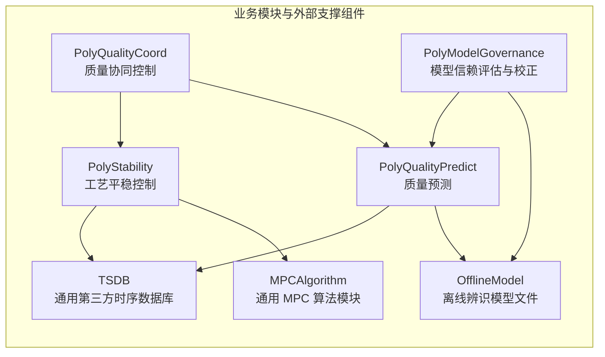

### 6.3 工艺平稳控制模块

建议 VM 类型：`PolyStability`。

主要职责：

- 读取关键工艺变量，例如温度、压力、流量、液位、阀位、负荷和组分相关变量。
- 执行工艺平稳控制策略，抑制扰动，减少操作变量波动。
- 处理 MV/CV/DV等变量配置、上下限、变化率限制和手自动状态。
- 通过自研 `libidh` 读写 OPC 数据，写入控制输出和看门狗。
- 通过 Storm 发布控制周期、运行态、变量趋势、告警和控制输出。

典型 RPC：

| RPC 方法 | 说明 |
| --- | --- |
| `downloadProject` | 下载工程配置和当前运行态。 |
| `uploadProjectConfig` | 上传并保存工程配置。 |
| `verifyAllOPCTags` | 验证 OPC 位号、读写权限和数据类型。 |
| `startSimulation` | 启动仿真模式。 |
| `stopSimulation` | 停止仿真模式。 |
| `startControl` | 启动在线控制。 |
| `stopControl` | 停止在线控制。 |
| `setValue` | 在线调整变量参数或控制参数。 |

### 6.4 质量协同控制模块

建议 VM 类型：`PolyQualityCoord`。

主要职责：

- 统一管理质量目标、约束、优先级和协同策略。
- 根据质量预测结果和工艺平稳控制状态生成目标调整或约束建议。
- 协调多个控制工程之间的控制权、目标冲突和降级策略。
- 支持多牌号、多生产线、多装置协同。

关键设计：

- 不直接写 DCS，除非被配置为最终控制输出模块。
- 与其他 VM 交互必须通过 RPC 或定义清晰的内部事件，不共享可变内存。
- 多模块同时写入同一 DCS 标签时，必须通过控制权租约或互锁机制解决冲突。

### 6.5 质量预测模块

建议 VM 类型：`PolyQualityPredict`。

主要职责：

- 根据工艺变量、历史数据、实验室质量数据和牌号信息实时预测质量指标。
- 输出软测量值、未来趋势、置信度、残差和可用性标志。
- 支持模型文件加载、模型版本切换、预测结果归档。
- 为质量协同控制和模型治理提供输入。

典型输出：

| 输出 | 说明 |
| --- | --- |
| `qualityValue` | 当前质量预测值。 |
| `predictionHorizon` | 未来若干采样点预测序列。 |
| `confidence` | 模型置信度。 |
| `residual` | 预测残差。 |
| `validity` | 当前预测是否可用于控制。 |

### 6.6 模型信赖评估与校正模块

建议 VM 类型：`PolyModelGovernance`。

主要职责：

- 评估预测模型和控制模型的健康度。
- 检测模型漂移、数据分布漂移、残差异常和工况切换。
- 生成模型健康度评估、离线重辨识建议和人工确认任务。
- 管理离线模型版本、评估记录、生效记录和回滚信息。

默认策略：

- 在线生产环境中，离线新模型不应自动覆盖当前控制模型。
- 模型生效应由工程师确认，或满足严格的自动审批条件。
- 每次模型切换必须保留旧版本，支持快速回滚。

### 6.7 数据源抽象

后端 module 统一使用数据源抽象访问不同来源的数据：

| 数据源 | 用途 |
| --- | --- |
| `OPC` | 现场 DCS 实时数据读写。 |
| `CSV` | 离线测试、历史数据回放。 |

推荐数据源 schema 示例：

```text
opc.da://127.0.0.1:4840/PolymerDCS
opc.tcp://dcs-host:22510/server?ds_device=1
CSV://D:/cases/polymer_quality_replay.csv
```

## 7. xOptCon 前端工程插件设计

### 7.1 前端定位

`xOptCon` 是工程师面向系统的主要操作入口，负责工程管理、配置编辑、在线监控、仿真、测试、日志查看和人工确认。xOptCon 不执行实时控制闭环，也不直接访问 DCS。

### 7.2 工程类型映射

| xOptCon 工程类型 | 后端 VM 类型 | 文件扩展名 | 主要用途 |
| --- | --- | --- | --- |
| 工艺平稳控制工程 | `PolyStability` | `.pstb` | 工艺变量配置、控制参数、启停、趋势监控。 |
| 质量协同控制工程 | `PolyQualityCoord` | `.pqcc` | 质量目标、约束、协同策略和冲突处理。 |
| 质量预测工程 | `PolyQualityPredict` | `.pqpr` | 软测量配置、预测模型、预测趋势和误差分析。 |
| 模型评估校正工程 | `PolyModelGovernance` | `.pmgv` | 模型健康度、漂移检测、校正建议和版本管理。 |

### 7.3 插件内部结构

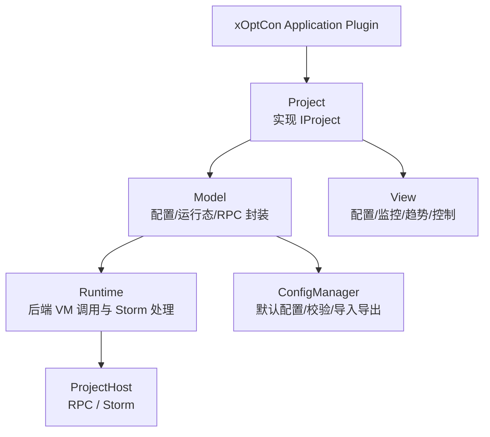

插件应实现以下能力：

- 注册工程类型：显示名、内部类型 ID、描述、文件扩展名和图标。
- 创建工程：生成默认配置和本地工程文件。
- 连接后端：通过 `ProjectHost` 连接 HostVM，加载远程 VM 实例。
- 同步配置：通过 RPC 下载和上传工程配置。
- 订阅事件：通过 Storm 接收运行态、历史数据、日志和告警。
- 运行操作：启动/停止测试、仿真、预测、控制和模型评估。
- 状态显示：显示 RPC 连接状态、Storm 连接状态、工程状态和控制状态。

### 7.4 前端页面建议

每类工程插件可按下列页面组织：

| 页面 | 内容 |
| --- | --- |
| 工程总览 | 工程状态、连接状态、当前模式、主要告警、版本信息。 |
| 变量配置 | OPC 位号、变量类型、单位、上下限、读写属性、有效性。 |
| 算法配置 | 控制参数、预测模型参数、评估策略、权重和约束。 |
| 在线监控 | 实时趋势、当前值、目标值、控制输出、质量预测值。 |
| 测试仿真 | 数据回放、阶跃测试、模型测试、离线仿真。 |
| 模型管理 | 模型版本、校正记录、评估结果、回滚操作。 |
| 日志告警 | 后端日志、操作记录、告警列表、确认记录。 |

## 8. 通信架构设计

### 8.1 通信通道总览

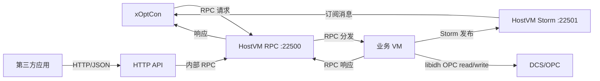

### 8.2 RPC 接口分类

| 分类 | 接口示例 | 说明 |
| --- | --- | --- |
| Host 管理 RPC | `listVM`、`newVM`、`uploadVM`、`deleteVM`、`startVM`、`stopVM`、`restartVM` | 管理工程实例生命周期。 |
| 工程配置 RPC | `downloadProject`、`uploadProjectConfig`、`reloadProjectConfig` | 同步工程配置和模型。 |
| OPC 校验 RPC | `enumOpcServerList`、`verifyAllOPCTags` | 枚举 OPC Server，验证位号。 |
| 运行控制 RPC | `startSimulation`、`stopSimulation`、`startControl`、`stopControl` | 控制仿真和在线控制状态。 |
| 在线调整 RPC | `setValue`、`setString`、`updateModel`、`updateModels` | 在线修改参数、位号、模型。 |
| 模型服务 RPC | `loadModel`、`validateModel`、`evaluateModel`、`activateModel`、`rollbackModel` | 离线辨识模型的导入、校验、评估、生效和回滚。 |

### 8.3 Storm 事件分类

| 事件 | 说明 |
| --- | --- |
| `LogText` | 后端日志、脚本输出、算法诊断信息。 |
| `ProjectInstance` | 工程实例创建、删除、启动、停止、状态变化。 |
| `LoopIteratorBegin/End` | 控制周期开始和结束。 |
| `ProjectConfig` | 配置变化。 |
| `ProjectModel` | 模型变化。 |
| `ProjectRuntime` | 运行态变化。 |
| `PredictionResult` | 质量预测结果。 |
| `ModelEvaluation` | 模型健康度和漂移检测结果。 |
| `TestingHisData` | 测试历史数据。 |
| `ControlHisData` | 控制历史数据。 |
| `Alarm` | 运行告警和安全事件。 |

### 8.4 第三方 HTTP API

HTTP API 作为 HostVM 的适配层，为 MES、LIMS、报表系统、运维平台等第三方系统提供访问能力。HTTP API 内部调用 HostVM/module 的 RPC，不直接操作工程文件或业务对象。

推荐 API：

| API | 方法 | 说明 |
| --- | --- | --- |
| `/api/v1/host` | GET | 获取宿主状态、版本、RPC 端口、Storm 端口。 |
| `/api/v1/projects` | GET | 获取工程实例列表。 |
| `/api/v1/projects` | POST | 创建工程实例。 |
| `/api/v1/projects/{name}` | GET | 获取工程概要。 |
| `/api/v1/projects/{name}/runtime` | GET | 获取运行态快照。 |
| `/api/v1/projects/{name}/commands/start` | POST | 启动仿真或控制。 |
| `/api/v1/projects/{name}/commands/stop` | POST | 停止运行。 |
| `/api/v1/projects/{name}/history` | GET | 查询历史数据索引或摘要。 |
| `/api/v1/events` | GET | 通过 SSE 或 WebSocket 订阅事件流。 |

HTTP API 不承担实时控制链路，适合状态查询、业务系统集成、报表、审计和非实时操作。

## 9. OPC/DCS 通讯设计

### 9.1 通讯边界

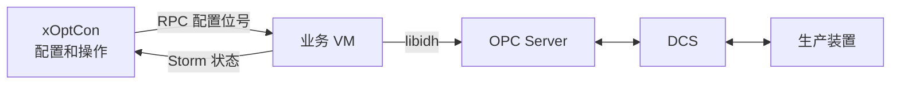

边界要求：

- 前端只配置 OPC 位号、采样周期、读写属性和校验结果，不直接连接 OPC。
- 后端 module 负责 OPC 连接、读写、错误处理、重连和数据质量判断。
- 在线控制输出写入必须经过状态机、安全检查和 DCS 手自动判断。

### 9.2 OPC 读写对象

| 对象 | 方向 | 说明 |
| --- | --- | --- |
| PV/CV 当前值 | 读 | 被控变量或质量变量当前值。 |
| MV 当前值 | 读 | 操作变量当前值。 |
| DV 当前值 | 读 | 干扰变量当前值。 |
| SP/目标值 | 读/写 | 控制目标或设定值。 |
| MV 输出 | 写 | 控制计算后的输出或建议值。 |
| 上下限 | 读 | DCS 或工艺约束。 |
| 手自动状态 | 读 | 判断是否允许写入。 |
| 控制启停标签 | 读/写 | 与 DCS 协同启停控制。 |
| 看门狗标签 | 写 | 告知 DCS 控制系统正常运行。 |

### 9.3 OPC 异常处理

| 异常 | 处理策略 |
| --- | --- |
| OPC 连接失败 | 禁止启动控制，发布告警。 |
| 单点读取失败 | 标记坏点，按配置选择保持、估计或降级。 |
| 连续读取失败 | 停止控制或切换安全模式。 |
| 写入失败 | 立即发布高优先级告警，停止或冻结控制输出。 |
| DCS 手自动不允许 | 拒绝写入，保持监控或仿真状态。 |
| 看门狗失败 | 控制器进入异常状态，通知 DCS 和 xOptCon。 |

## 10. 数据与信息流设计

### 10.1 工程创建流程

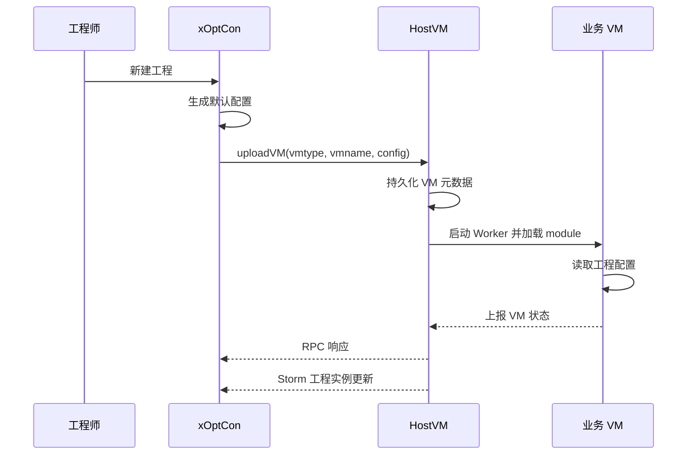

### 10.2 在线控制流程

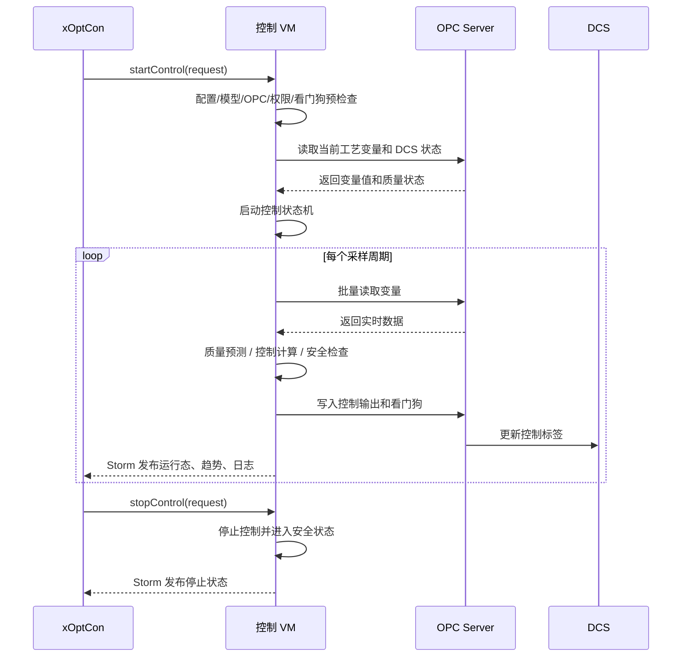

### 10.3 质量预测与模型评估流程

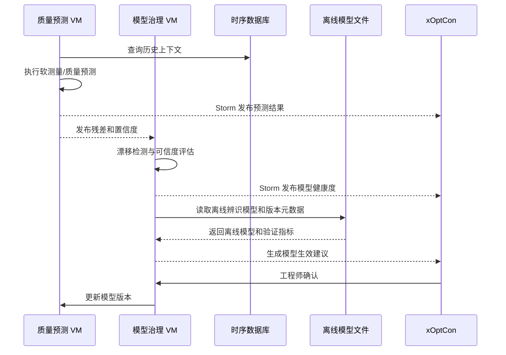

### 10.4 历史数据策略

历史数据不应长期堆积在前端或通过一次 RPC 全量传输。推荐策略：

- 运行态和轻量摘要通过 RPC 返回。
- 高频趋势数据通过 Storm 分片发布。
- 长周期历史数据进入 TSDB，可选用通用第三方时序数据库。
- 前端按时间范围、变量集合、工程名和批次查询。
- 离线模型训练和在线评估从历史数据服务读取，不依赖 UI 缓存。

## 11. 状态机设计

### 11.1 工程状态

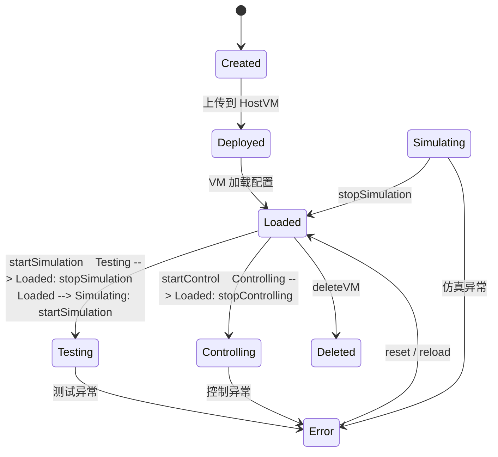

### 11.2 控制启动前检查

启动在线控制前必须完成：

| 检查项 | 要求 |
| --- | --- |
| 工程配置 | 采样周期、变量数量、位号、约束、模型参数合法。 |
| 模型状态 | 控制模型可用，预测模型置信度满足阈值。 |
| OPC 连接 | OPC Server 可连接，关键位号可读写。 |
| DCS 状态 | 控制权、手自动状态、联锁状态允许启动。 |
| 看门狗 | 看门狗位号配置有效，可写入。 |
| 控制互锁 | 同一输出标签没有其他 active controller。 |
| 历史记录 | 启动操作、工程版本、模型版本已记录。 |

## 12. 部署架构

### 12.1 单机开发部署

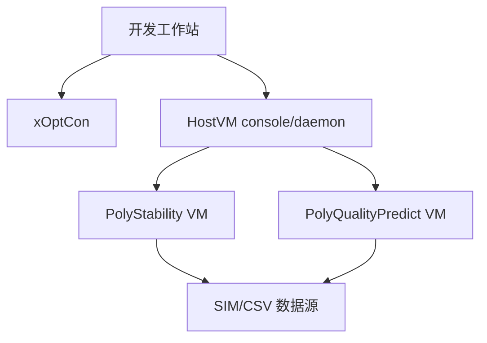

适用场景：

- 算法开发。
- UI 联调。
- 离线数据回放。
- RPC/Storm 接口测试。

### 12.2 现场生产部署

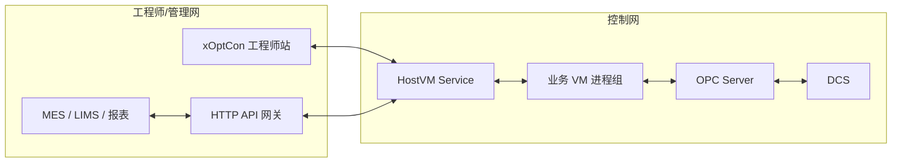

部署建议：

- HostVM 以 Windows Service 或 Linux systemd 服务运行。
- 控制相关 VM 部署在靠近 DCS/OPC 的控制网段。
- xOptCon 工程师站通过受控网络连接 HostVM。
- 第三方系统通过 HTTP API 访问非实时接口。
- 历史数据和模型文件设置备份策略。

### 12.3 高可用与容错

第一阶段建议采用“单 active 控制 + 备用监控”的策略：

- active HostVM 负责控制写入。
- standby HostVM 可读取状态、验证配置、准备接管，但默认不写 DCS。
- 控制权通过 DCS 标签、租约或数据库锁进行互锁。
- active 故障时，standby 接管前必须重新验证 OPC、DCS 和模型状态。

## 13. 安全与权限设计

### 13.1 操作权限

| 角色 | 权限 |
| --- | --- |
| 观察员 | 查看工程、趋势、状态、日志，不能修改和启停。 |
| 工程师 | 修改配置、执行测试、仿真、位号验证和模型评估。 |
| 控制工程师 | 启停在线控制、调整控制参数、确认离线模型生效。 |
| 管理员 | 管理工程实例、用户权限、第三方 API、系统配置。 |

### 13.2 审计要求

以下操作必须记录审计日志：

- 创建、上传、删除工程。
- 启动和停止在线控制。
- 修改 OPC 位号、控制参数、约束和模型。
- 导入离线模型、执行模型切换和回滚。
- 第三方 API 写操作。
- 控制异常、DCS 拒写、看门狗失败。

### 13.3 安全策略

- HTTP API 必须鉴权，不允许匿名控制命令。
- 生产环境默认禁止第三方 API 直接启动控制，除非明确授权。
- 离线新模型默认只生成生效建议，自动生效需单独审批。
- 控制写入必须检查 DCS 手自动状态和控制权。
- 故障降级策略必须优先保护装置安全。

## 14. 测试验证设计

### 14.1 功能测试

| 测试项 | 内容 |
| --- | --- |
| 工程管理 | 新建、加载、保存、上传、删除、重启恢复。 |
| RPC 接口 | 配置下载上传、启停、模型更新、位号验证。 |
| Storm 事件 | 日志、运行态、历史数据、告警、工程实例变化。 |
| OPC 通讯 | 枚举、连接、读写、断线、坏点、重连。 |
| DCS 协同 | 手自动状态、启停标签、看门狗、写入互锁。 |
| xOptCon 插件 | 工程树、页面切换、配置校验、趋势显示。 |

### 14.2 算法测试

| 模块 | 测试内容 |
| --- | --- |
| 工艺平稳控制 | 阶跃扰动、约束触碰、稳态误差、输出平滑性。 |
| 质量协同控制 | 多目标冲突、权重切换、约束冲突、降级策略。 |
| 质量预测 | 预测误差、滞后补偿、置信区间、坏数据鲁棒性。 |
| 模型治理 | 漂移检测、误报漏报、离线模型生效收益、回滚有效性。 |

### 14.3 性能测试

| 指标 | 目标 |
| --- | --- |
| 控制周期耗时 | 在采样周期内完成读数、计算、写入和发布。 |
| RPC 响应时间 | 常规配置和控制命令在工程可接受时间内响应。 |
| Storm 吞吐 | 支持多工程实时趋势和日志并发发布。 |
| 长周期稳定性 | 连续运行 7 天以上无明显内存增长、死锁、句柄泄漏。 |
| 异常恢复 | HostVM 重启、VM 崩溃、OPC 断线、DCS 拒写后行为可控。 |

## 15. 开发实施路线

### 15.1 第一阶段：最小闭环

目标是打通一个可运行、可演示、可测试的端到端闭环。

实施内容：

- 选择 `PolyStability` 或 `PolyQualityPredict` 作为首个新 module。
- 定义工程配置、运行态、RPC 和 Storm 事件。
- 在 xOptCon 中注册对应工程插件。
- 实现工程上传、下载、启动、停止和运行态显示。
- 接入 `libidh` 完成 OPC 位号验证和基础读写。
- 支持 SIM/CSV 数据源进行离线仿真。

### 15.2 第二阶段：多模块协同

实施内容：

- 增加质量协同控制 module。
- 增加模型信赖评估与校正 module。
- 定义模块间 RPC 合同和失败降级策略。
- 接入历史数据服务，支持趋势查询和模型评估数据回放。
- 建立统一变量字典、质量指标字典和工程模板。

### 15.3 第三阶段：现场化与集成

实施内容：

- 增加 HostVM HTTP API adapter。
- 完成鉴权、审计、权限和生产部署配置。
- 完成 DCS 联调、长周期测试、性能测试和异常恢复测试。
- 支持多装置、多牌号、多工程批量管理。

## 16. 风险与控制措施

| 风险 | 影响 | 控制措施 |
| --- | --- | --- |
| HostVM 混入业务逻辑 | 宿主膨胀、难以维护 | 规定 HostVM 只做宿主和 adapter，业务全部放入 module。 |
| 多模块重复实现通用能力 | 行为不一致、维护成本高 | 抽象 module 公共 SDK，复用 RPC、Storm、OPC、状态机模式。 |
| HTTP API 被用于实时控制 | 延迟和一致性风险 | xOptCon 主链路保持 RPC/Storm，HTTP 只做第三方集成。 |
| 多模块同时写 DCS | 生产安全风险 | 控制权互锁、租约、DCS 手自动检查和写标签白名单。 |
| 历史数据阻塞 RPC | UI 卡顿、网络压力大 | RPC 返回轻量数据，历史数据走 Storm 分片或 TSDB 查询。 |
| 离线新模型直接生效 | 控制风险 | 默认人工确认，保留版本和回滚机制。 |
| Python/复杂算法阻塞控制周期 | 控制超时 | 算法服务隔离、RPC 超时、缓存结果和降级运行。 |
| OPC 断线或坏点 | 控制输出异常 | 启动前校验、运行中数据质量判断、异常停控或保持策略。 |

## 17. 结论

聚合物产品质量实时控制系统采用 `HostVM + 业务 modules + xOptCon application plugin` 架构是合理且可持续演进的。该架构充分复用现有 HostVM 的进程宿主、RPC、Storm、配置和子 VM 管理能力，同时将控制、预测、模型评估、OPC/DCS 通讯等业务能力隔离到独立 module 中；xOptCon 则以工程插件方式提供专业化界面和工程管理能力。

该方案的核心价值在于：

- 后端可扩展：新增控制能力只需新增 module 和 VM 类型。
- 前端可扩展：新增工程类型只需新增 xOptCon application plugin。
- 通讯清晰：命令走 RPC，事件走 Storm，第三方集成走 HTTP API。
- 安全可控：OPC/DCS 写入集中在后端，便于统一校验、互锁和审计。
- 工程可落地：支持从单模块最小闭环逐步演进到多模块协同和现场生产部署。

建议优先实现一个最小闭环 module，完成从 xOptCon 创建工程、上传 HostVM、后端 VM 加载配置、OPC/SIM 数据读取、运行态 Storm 发布到前端显示的端到端链路。完成该闭环后，再扩展质量协同控制、模型信赖评估与校正、HTTP API 和现场化部署能力。
